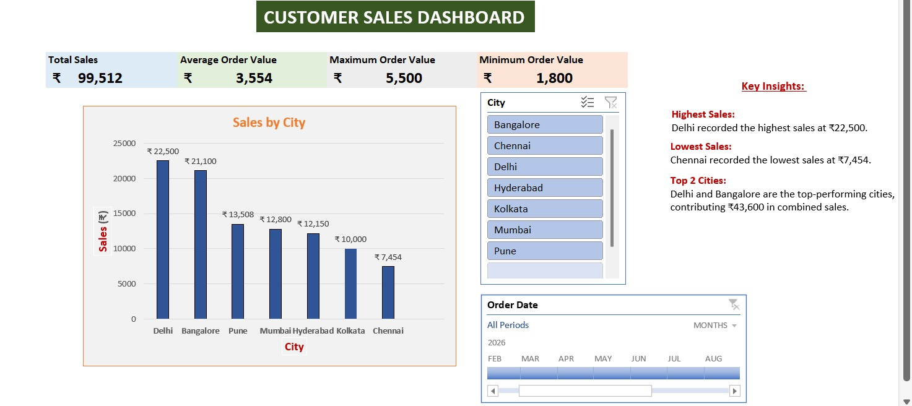

# Customer Sales Dashboard – Excel

## Project Overview
This project analyzes customer sales data using Microsoft Excel and presents the results through an interactive dashboard. The goal is to track key sales metrics, compare city-wise performance, and identify useful business insights.

## Dashboard Preview

## Tools & Skills Used
- Microsoft Excel
- Power Pivot
- Data Cleaning
- Data Analysis
- Data Visualization
- KPI Analysis
- Slicers and Timeline Filters

## Key KPIs
- Total Sales: ₹99,512
- Average Order Value: ₹3,554
- Maximum Order Value: ₹5,500
- Minimum Order Value: ₹1,800

## Key Insights
- Delhi recorded the highest sales at ₹22,500.
- Chennai recorded the lowest sales at ₹7,454.
- Delhi and Bangalore were the top-performing cities with combined sales of ₹43,600.

## Dashboard Features
- Interactive City slicer
- Order Date timeline filter
- City-wise sales comparison
- KPI summary cards
- Business insights section

## Project Files
- `Customer_Sales_Dashboard.xlsx` – Complete Excel dashboard
- `Customer_Sales_Dashboard_Preview.jpeg` – Dashboard preview
